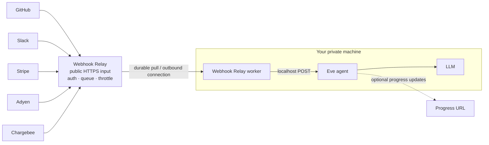

# `@webhookrelay/eve-channel`

An Eve message layer backed by Webhook Relay. GitHub, Slack, Stripe, Adyen,
Chargebee, and any other webhook provider send to Relay’s public URL. Your Eve
agent can then run on a Mac mini, laptop, Raspberry Pi, or private server with
no inbound port exposed.



The default private mode uses an outbound pull worker. The machine connects to
Relay; Relay never connects inbound to it. An HTTP mode is also available when
the Eve route is deployed at a public HTTPS URL.

## Install

```bash
npm install eve ai zod @ai-sdk/openai-compatible @webhookrelay/sdk \
  @webhookrelay/eve-channel
```

## Channel

Create `agent/channels/webhookrelay.ts`:

```ts
import { webhookRelayChannel } from "@webhookrelay/eve-channel";

export default webhookRelayChannel({
  bucket: process.env.RELAY_BUCKET ?? "eve-demo",
  sharedSecret: process.env.RELAY_SHARED_SECRET,
  progressUrl: process.env.PROGRESS_URL,
});
```

This adds `POST /webhookrelay`. It accepts a JSON `message`, optional `context`,
`continuationToken`, and `progressUrl`. If `message` is omitted, the complete
JSON payload is formatted as the Eve message.

## Provisioning

`provisionWebhookRelay()` is idempotent. It creates the bucket, provider-facing
input, and output once, then reuses them. Existing output settings are left
untouched, so configure throttling and delivery policy in Webhook Relay without
the agent overwriting them.

### Private machine: outbound pull mode

```ts
import { provisionWebhookRelay } from "@webhookrelay/eve-channel";

const relay = await provisionWebhookRelay({
  bucket: "eve-demo",
  delivery: "private-pull",
  sharedSecret: process.env.RELAY_SHARED_SECRET,
});

console.log(relay.endpointUrl); // give this URL to GitHub, Stripe, etc.
console.log(relay.outputId); // pass this to the private worker
```

Run the worker beside Eve:

```ts
import { startWebhookRelayWorker } from "@webhookrelay/eve-channel";

const worker = startWebhookRelayWorker({
  bucket: "eve-demo",
  output: "eve",
  endpoint: "http://127.0.0.1:2000/webhookrelay",
  sharedSecret: process.env.RELAY_SHARED_SECRET,
});

await worker.done;
```

The pull queue is durable until an event is handed to the worker. Keep the
worker supervised (systemd, Docker, launchd, or similar) for production use.

### Public HTTP mode

If Eve is intentionally deployed at a public HTTPS URL, Relay can forward
directly to it:

```ts
await provisionWebhookRelay({
  bucket: "eve-demo",
  delivery: "http",
  endpoint: "https://agent.example.com/webhookrelay",
  sharedSecret: process.env.RELAY_SHARED_SECRET,
});
```

Relay’s HTTP output can retry when Eve is unavailable. For a private Mac,
laptop, or Raspberry Pi, use the outbound worker instead.

## Configuration reference

### `webhookRelayChannel(options)`

| Option         | Required | Default         | Description                                          |
| -------------- | -------- | --------------- | ---------------------------------------------------- |
| `bucket`       | yes      | —               | Relay bucket name or id.                             |
| `input`        | no       | `eve`           | Input name used by provisioning.                     |
| `output`       | no       | `eve`           | Output name used by provisioning.                    |
| `path`         | no       | `/webhookrelay` | Eve HTTP route path.                                 |
| `sharedSecret` | no       | —               | Checks `Authorization: Bearer ...` on the Eve route. |
| `progressUrl`  | no       | —               | Default URL for lifecycle updates.                   |

### `provisionWebhookRelay(options)`

| Option                | Required  | Default    | Description                                                             |
| --------------------- | --------- | ---------- | ----------------------------------------------------------------------- |
| `bucket`              | yes       | —          | Relay bucket name or id.                                                |
| `delivery`            | no        | `http`     | `http` or `private-pull`.                                               |
| `endpoint`            | HTTP mode | —          | Public Eve HTTPS URL. Omit for private pull.                            |
| `input`               | no        | `eve`      | Provider-facing input name.                                             |
| `output`              | no        | `eve`      | Relay output name.                                                      |
| `sharedSecret`        | no        | —          | Shared app secret; not the Relay API key.                               |
| `bucketAuth`          | no        | —          | Optional provider-facing bucket auth.                                   |
| `response.statusCode` | no        | `202`      | Immediate provider response status.                                     |
| `response.body`       | no        | `accepted` | Immediate provider response body.                                       |
| `outputOptions`       | no        | —          | Creation-time description, headers, retries, timeout, and TLS settings. |
| `relay`               | no        | SDK client | Inject a configured `WebhookRelay` client.                              |

### `startWebhookRelayWorker(options)`

| Option         | Required | Default     | Description                                                     |
| -------------- | -------- | ----------- | --------------------------------------------------------------- |
| `bucket`       | yes      | —           | Relay bucket name or id.                                        |
| `output`       | yes      | —           | Private output name or id.                                      |
| `endpoint`     | yes      | —           | Local Eve route, normally `http://127.0.0.1:2000/webhookrelay`. |
| `sharedSecret` | no       | —           | Secret sent to the Eve route.                                   |
| `intervalMs`   | no       | SDK default | Empty-queue polling interval.                                   |
| `onError`      | no       | —           | Worker forwarding error handler.                                |
| `relay`        | no       | SDK client  | Inject a configured `WebhookRelay` client.                      |

## Environment variables

```env
RELAY_API_KEY=sk-...
RELAY_BUCKET=eve-demo
RELAY_DELIVERY=private-pull
RELAY_SHARED_SECRET=generate-a-separate-random-secret
EVE_LOCAL_URL=http://127.0.0.1:2000/webhookrelay
EVE_PUBLIC_URL=
PROGRESS_URL=

LIGHTNING_API_KEY=
LIGTNING_API_KEY=
LIGHTNING_MODEL=openai/gpt-5.4-mini-2026-03-17
```

`RELAY_API_KEY` authenticates SDK control-plane calls to Webhook Relay.
`RELAY_SHARED_SECRET` is an independent application secret used only between
the Relay worker/output and Eve. Never use the API key as the shared secret.

## Complete example

The Lightning-backed app is in [`example/`](example/). Copy `.env.example` to
`example/.env`, then run:

```bash
cd example
npm install
npm run dev       # Eve, in one terminal
npm run provision # create/reuse Relay resources, in another
npm run worker    # private outbound worker, in a third
```

Set `RELAY_DELIVERY=http` and `EVE_PUBLIC_URL` to use direct HTTP output
instead. The model example maps AI SDK’s `max_tokens` to Lightning’s required
`max_completion_tokens` field and accepts both Lightning key spellings.

## Development

```bash
npm test
npm run typecheck
npm run build
npm run pack:check
```

## Publishing

The package is published as `@webhookrelay/eve-channel` from GitHub Actions
when a matching version tag is pushed. For example:

```bash
npm version patch
git push origin main --follow-tags
```

Before the first release, configure npm Trusted Publishing in the package
settings at npmjs.com:

| Setting | Value |
| --- | --- |
| Provider | GitHub Actions |
| Organization/user | `webhookrelay` |
| Repository | `eve-channel` |
| Workflow filename | `publish.yml` |
| Allowed action | `npm publish` |

The workflow uses OIDC and does not require an npm token in GitHub Secrets.
The scoped package is explicitly published with public access and receives npm
provenance when the repository and package are public. Check the contents
locally with `npm run pack:check` before creating a release.

## CI

GitHub Actions runs unit/build checks on every push and pull request. The live
Relay suite runs on pushes to `main` when the repository has this GitHub Secret:

```text
RELAY_API_KEY
```

The workflow creates the marked `e2e-eve-agent` bucket, runs sequential, burst,
and consumer-failure recovery tests one event at a time, then removes all test
resources. The secret is injected through `${{ secrets.RELAY_API_KEY }}` and is
never committed to the repository.

MIT License.
